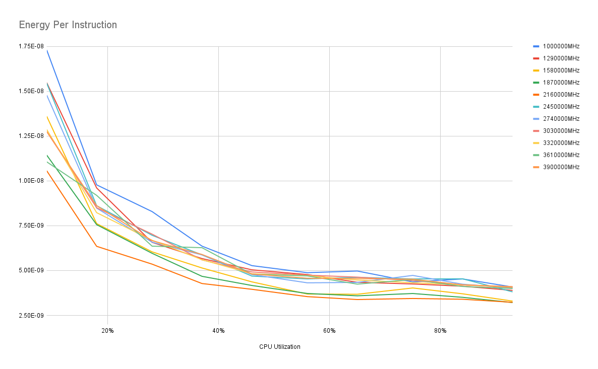

# Measure Energy per Instruction 

This experiment uses metrics exported by Kepler to measure energy consumed per CPU instruction during the sampling interval.

# Setup

The workload is `sysbench cpu`. The script is [tune-freq.sh](./tune-freq.sh)

By varying the number of threads, the workload generate a controlled CPU utilization.

The CPU frequency managed by `cpupower`. The lower and upper frequency are set the same so the CPU cores are at a controlled levels.

There are ramping up and cooling off period during the workload run. After each run, the metrics are scrapped and energy per instruction is calculated.

# Report
The script [energy-per-instruction.sh](./energy-per-instruction.sh) extracts the data and generates a csv based report, detailing the energy per instruction at different CPU frequency and utilization.

# Result
A test run on an 64 core Intel Cascade Lake CPU is
```csv
CPU Utilization,1000000MHz,1290000MHz,1580000MHz,1870000MHz,2160000MHz,2450000MHz,2740000MHz,3030000MHz,3320000MHz,3610000MHz,3900000MHz,
9%, 1.7296206348238605e-08, 1.547346451584431e-08, 1.3601331752249747e-08, 1.1435514407403511e-08, 1.0565195403476548e-08, 1.5445811775190773e-08, 1.4782761405624396e-08, 1.2750808897277239e-08, 1.2866982780773292e-08, 1.1062015483838582e-08, 1.2757076201910128e-08
18%, 9.779028586941138e-09, 9.606387771732467e-09, 7.617750186822118e-09, 7.55997427848829e-09, 6.352044285955936e-09, 8.617662136736497e-09, 8.48203716279592e-09, 8.504051819912864e-09, 8.229473572040198e-09, 9.193865121188223e-09, 8.616798429356528e-09
28%, 8.288814763402634e-09, 6.572060078940903e-09, 6.043458685068429e-09, 5.96245695284838e-09, 5.358294274403311e-09, 6.966673670257035e-09, 6.581992857035259e-09, 7.0315677691314725e-09, 6.688833579740651e-09, 6.3616530149400204e-09, 6.666917321825177e-09
37%, 6.36102133077747e-09, 5.668576962467053e-09, 5.144771469837263e-09, 4.679165068997931e-09, 4.277168310961117e-09, 5.874073394244608e-09, 5.8725747965058774e-09, 5.593749277244236e-09, 5.6063594189025215e-09, 6.274844858743043e-09, 5.8974206854696386e-09
46%, 5.274617482958565e-09, 5.041063398407146e-09, 4.369636951292991e-09, 4.167533394184778e-09, 3.955525895097429e-09, 4.691494901705555e-09, 4.7774731200118364e-09, 4.923469475171409e-09, 4.822499870543116e-09, 4.797704185501724e-09, 4.808246239481239e-09
56%, 4.8818518980867455e-09, 4.7776424162771956e-09, 3.691177347036698e-09, 3.7224700347154794e-09, 3.546539664915394e-09, 4.535048481442218e-09, 4.316585739550465e-09, 4.74463185963151e-09, 4.713294238462161e-09, 4.702997322533959e-09, 4.5704458135400355e-09
65%, 4.974573688248229e-09, 4.346496753990463e-09, 3.6795736941381683e-09, 3.5927038367302125e-09, 3.384284228334639e-09, 4.62050628602467e-09, 4.34098258332704e-09, 4.633854016949717e-09, 4.470902440012777e-09, 4.243857455132293e-09, 4.5513213086253675e-09
75%, 4.367778683922438e-09, 4.251838632724604e-09, 4.02998255439213e-09, 3.720715692135932e-09, 3.4433075809393986e-09, 4.533327646597167e-09, 4.7293383747647064e-09, 4.446065142962741e-09, 4.321484777287144e-09, 4.502529145109424e-09, 4.518867242854039e-09
84%, 4.532162758619137e-09, 4.126551982008497e-09, 3.703534390332758e-09, 3.5080197720901556e-09, 3.400616120941771e-09, 4.538681763417505e-09, 4.239331118702217e-09, 4.203371857616069e-09, 4.20190196671353e-09, 4.111959113395979e-09, 4.201978943194778e-09
93%, 4.084371729690318e-09, 3.894883584065643e-09, 3.2978250369271744e-09, 3.215897387083337e-09, 3.2304919122443463e-09, 3.812789281418219e-09, 4.032721659927649e-09, 4.1067882531975414e-09, 4.084882222989251e-09, 4.002859671284986e-09, 4.068912841501768e-09
```



